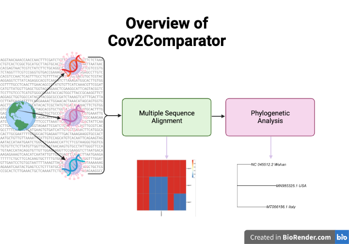

<!-- README.md is generated from README.Rmd. Please edit that file -->

```{r, include = FALSE}
knitr::opts_chunk$set(
  collapse = TRUE,
  comment = "#>",
  fig.path = "man/figures/README-",
  out.width = "100%"
)
```

# Cov2Comparator

<!-- badges: start -->
<!-- badges: end -->

The goal of Cov2Comparator is to analyze SARS covid-2 genome 
  across different geographic regions including performing multiple sequence alignments and phylogenetic tree.

## Installation

You can install the development version of Cov2Comparator from [GitHub](https://github.com/) with:

``` r
require("devtools")
devtools::install_github("quick2063706271/Cov2Comparator", build_vignettes = TRUE)
library("Cov2Comparator")
```

To run the shinyApp:
Under construction

## Overview
```r
ls("package:Cov2Comparator")
data(package = "Cov2Comparator") 
```

### Vignettes
```r
browseVignettes("Cov2Comparator")
```
An overview of the package is illustrated below. 

```
.
├── Cov2Comparator.Rproj
├── DESCRIPTION
├── LICENSE
├── LICENSE.md
├── NAMESPACE
├── R
│   ├── phylogeneticTree.R
│   ├── readData.R
│   └── sequenceComparison.R
├── README.Rmd
├── README.md
├── data
│   ├── accessionIDToRegion.rda
│   └── simpleAlign.rda
├── inst
│   └── extdata
│       ├── MN985325.1.fasta
│       ├── MT066156.1.fasta
│       ├── MW309440.1.fasta
│       ├── NC_045512.2.fasta
│       ├── nameToCountry.txt
│      └── overviewCov2.png
├── man
│   ├── createTree.Rd
│   ├── figures
│   │   └── README-pressure-1.png
│   ├── getSequenceByRegion.Rd
│   ├── getSequencesByRegions.Rd
│   ├── multipleSeqAlign.Rd
│   ├── plotAlignment.Rd
│   ├── plotTree.Rd
│   └── readGenome.Rd
├── tests
│   ├── testthat
│   │   ├── Rplots.pdf
│   │   ├── _snaps
│   │   ├── test-createTree.R
│   │   ├── test-getSequenceByRegion.R
│   │   ├── test-getSequencesByRegions.R
│   │   ├── test-multipleSeqAlign.R
│   │   ├── test-plotAlignment.R
│   │   ├── test-plotTree.R
│   │   └── test-readGenome.R
│   └── testthat.R
└── vignettes
    ├── Cov2Comparator.R
    ├── Cov2Comparator.Rmd
    └── Cov2Comparator.html
```



## Contribution
The author of this package is Kuai Yu. __*readGenome*__, __*getSequenceByRegion*__, __*getSequencesByRegions*__, __*plotAlignment*__  functions make use of __*Biostrings*__ package for converting fasta files and alignment to format DNAStringSet. __*getSequenceByRegion*__ function also makes use of __*ape*__ package to download sequence from Genbank online. __*multipleSeqAlign*__ function uses __*msa*__ package to perform multiple sequence alignment. __*plotAlignment*__ package function also uses __*pheatmap*__ package to plot the result. __*createTree*__ function uses __*msa*__ package to convert data type, and __*seqinr*__ to convert alignment to distance matrix. Then __*ape*__ package is used to create the tree. The __*plotTree*__ function makes use of the __*graphic*__ R package.


## Reference
R Core Team (2021). R: A language and environment for statistical computing. 
R Foundation for Statistical Computing, Vienna, Austria. URL
  https://www.R-project.org/.

Charif, D. and Lobry, J.R. (2007). SeqinR 1.0-2: a contributed package to the R
project for statistical computing devoted to biological sequences retrieval
and analysis. Structural approaches to sequence evolution: Molecules, networks,
populations, series Biological and Medical Physics, Biomedical Engineering,
207-232. Springer Verlag, New York.

Ulrich Bodenhofer, Enrico Bonatesta, Christoph Horejs-Kainrath, & Sepp Hochreiter (2015). msa: an R package for multiple sequence alignment. Bioinformatics, 31(24), 3997–3999.

Paradis E. & Schliep K. (2019). ape 5.0: an environment for modern
phylogenetics and evolutionary analyses in R. Bioinformatics 35: 526-528.

Raivo Kolde (2019). pheatmap: Pretty Heatmaps. R package version 1.0.12.
https://CRAN.R-project.org/package=pheatmap

BioRender. (2020). Image created by Silva, A. Retrieved November 16, 2021, from https://app.biorender.com/

## Acknowledgemments
This package was developed as part of an assessment for 2021 BCB410H: Applied Bioinformatics, University of Toronto, Toronto, CANADA.


