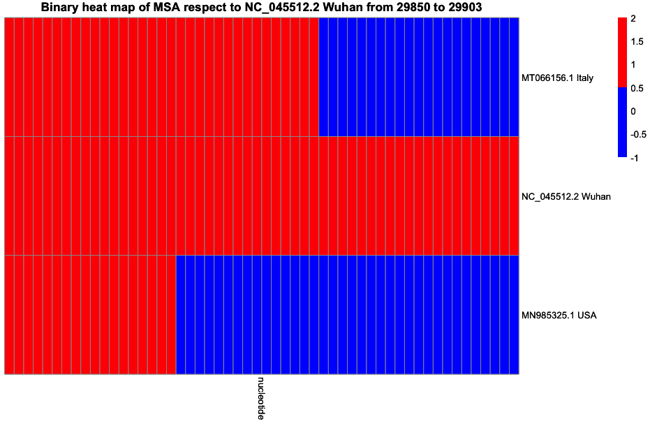
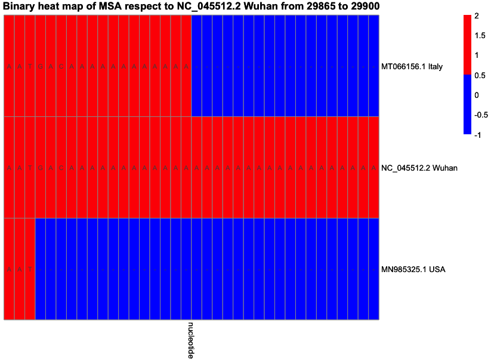
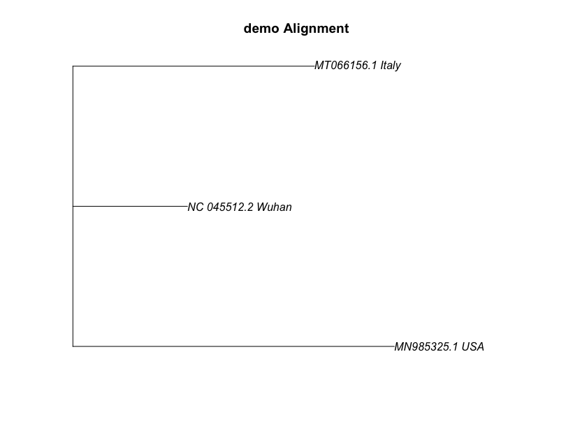
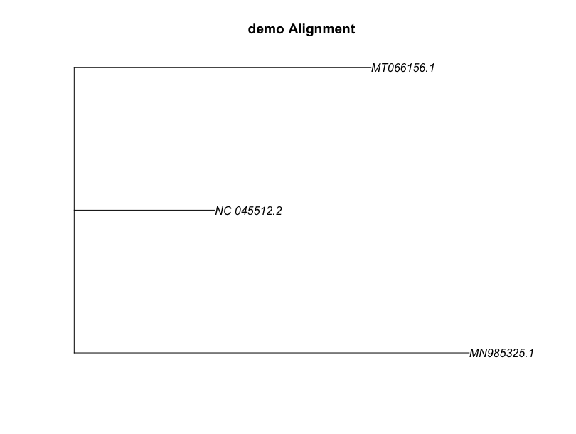
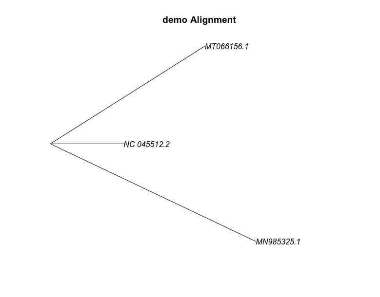

```{r, include = FALSE}
knitr::opts_chunk$set(
  collapse = TRUE,
  comment = "#>"
)
```

## Introduction
Cov2Comparator is a package that analyzes SARS covid-2 genome across different 
geographic regions. It allows easy retrieval of SARS COV-2 genome 
. It can perform multiple sequence alignments and 
phylogenetic tree. Plot of multiple sequence alignments and 
phylogenetic tree can be generated for interpretation. This document gives a 
tour of Cov2Comparator package.

see `help(package = "Cov2Comparator")` for more information and 
references provided by `citation("Cov2Comparator")`

To download **Cov2Comparator**, use the following commands:

```r
require("devtools")
devtools::install_github("quick2063706271/Cov2Comparator", build_vignettes = TRUE)
library("Cov2Comparator")
```

To list all functions available in this package:

```r
ls("package:Cov2Comparator")
```

To list dataset in this package:

``` r
data(package = "Cov2Comparator")
```

## Components
There are 7 functions in this package

### Loading and retrieving sequence from NCBI 
There are three ways to load and retrieve sequence. 
__*getSequenceByRegion*__ allows user to retrieve a SARS-COV2 genome by 
inputting a region which user desired. Current supports input from 
(Canada, Italy, Wuhan, USA, Kenya, Bahrain, Germany, Pakistan, Britain, 
Thailand)

Here is an example.
```r
# Please make sure you are connected to the internet
wuhanSeq <- getSequenceByRegion("Wuhan")
print(wuhanSeq)
```
```
# DNAStringSet object of length 1:
#    width seq                                                                                                                            names               
# [1] 29903 ATTAAAGGTTTATACCTTCCCAGGTAACAAACCAACCAACTTTCGATCTCTTGTAGATCTGT...
GATTTTAATAGCTTCTTAGGAGAATGACAAAAAAAAAAAAAAAAAAAAAAAAAAAAAAAAA NC_045512.2 Wuhan
```

__*getSequencesByRegions*__ allows user to retrieve a SARS-COV2 genome by 
inputting multiple regions which user desired. Current supports input from 
(Canada, Italy, Wuhan, USA, Kenya, Bahrain, Germany, Pakistan, Britain, 
Thailand)

```r
# Please make sure you are connected to the internet
regions <- c("Wuhan", "Italy", "USA")
seqs <- getSequencesByRegions(regions)
print(seqs)
```

The last way to add is using __*readGenome*__. This function allows user to input fasta file as input, user can also include a nameToRegion file, which contains one to one correspondence of accessionID and region.
```r
fastaPath1 <- system.file("extdata", "MN985325.1.fasta", package="Cov2Comparator")
nameToRegionsFile <- system.file("extdata", "nameToCountry.txt", package="Cov2Comparator")
fasta1 <- readGenome(fastaPath1, nameToRegionsFile)
fasta1
```

```
# DNAStringSet object of length 1:
#     width seq                                                                                                                  names               
# [1] 29882 ATTAAAGGTTTATACCTTCCCAGGTAACAAACCAACCAACTTTCGATCTCTTGTAGA...AGTGCT
ATCCCCATGTGATTTTAATAGCTTCTTAGGAGAATGACAAAAAAAAAAAA MN985325.1 USA
```

User do not to provide nameToRegion file. In that case, users are recommanded to
modify the name by themselves

```r
fastaPath1 <- system.file("extdata", "MN985325.1.fasta", package="Cov2Comparator")
nameToRegionsFile <- system.file("extdata", "nameToCountry.txt", package="Cov2Comparator")
fasta1 <- readGenome(fastaPath1)
print(fasta1)
# After modifying name
cat("\nAfter modifying name\n\n")
names(fasta1) <- c("MN985325.1 USA")
print(fasta1)
```

```
# DNAStringSet object of length 1:
#     width seq                                                                                                                  names               
# [1] 29882 ATTAAAGGTTTATACCTTCCCAGGTAACAAACCAACCAACTTTCGATCTCTTGTAGA...
AGTGCTATCCCCATGTGATTTTAATAGCTTCTTAGGAGAATGACAAAAAAAAAAAA MN985325.1 Severe...
#
# After modifying name
#
# DNAStringSet object of length 1:
#     width seq                                                                                                                  names               
# [1] 29882 ATTAAAGGTTTATACCTTCCCAGGTAACAAACCAACCAACTTTCGATCTCTTGTAGA...AGTGC
TATCCCCATGTGATTTTAATAGCTTCTTAGGAGAATGACAAAAAAAAAAAA MN985325.1 USA
```

## multiple sequence alignment
After loading the data, we can perform a multiple sequence alignment using 
__*multiplSeqAlign*__. This functions is derived from __*msa::msa*__ 
```r
# It will takes several minutes
seqs
align <- multipleSeqAlign(seqs, algorithm = 'ClustalW')
align
```
```
# DNAStringSet object of length 3:
#     width seq                                                                                                                  names               
# [1] 29903 ATTAAAGGTTTATACCTTCCCAGGTAACAAACCAACCAACTTTCGATCTCTTGTAGA...TAATA
GCTTCTTAGGAGAATGACAAAAAAAAAAAAAAAAAAAAAAAAAAAAAAAAA NC_045512.2 Wuhan
# [2] 29867 ATTAAAGGTTTATACCTTCCCAGGTAACAAACCAACCAACTTTCGATCTCTTGTAGA...AAAA
TTAATTTTAGTAGTGCTATCCCCATGTGATTTTAATAGCTTCTTAGGAGAAT MT066156.1 Italy
# [3] 29882 ATTAAAGGTTTATACCTTCCCAGGTAACAAACCAACCAACTTTCGATCTCTTGTAGA...AGTGC
TATCCCCATGTGATTTTAATAGCTTCTTAGGAGAATGACAAAAAAAAAAAA MN985325.1 USA
# use default substitution matrix
# CLUSTAL 2.1  
# 
# Call:
#    msa::msaClustalW(sequences)
#
# MsaDNAMultipleAlignment with 3 rows and 29903 columns
#     aln                                                                                                                       names
# [1] ATTAAAGGTTTATACCTTCCCAGGTAACAAACCAACCAACTTTCGATCTCTTGTAGATC...TTTTAATAG
CTTCTTAGGAGAATGACAAAAAAAAAAAAAAAAAAAAAAAAAAAAAAAAA NC_045512.2 Wuhan
# [2] ATTAAAGGTTTATACCTTCCCAGGTAACAAACCAACCAACTTTCGATCTCTTGTAGATC...TTTTAATAG
CTTCTTAGGAGAATGACAAAAAAAAAAAA--------------------- MN985325.1 USA
# [3] ATTAAAGGTTTATACCTTCCCAGGTAACAAACCAACCAACTTTCGATCTCTTGTAGATC...TTTTAATAG
CTTCTTAGGAGAAT------------------------------------ MT066156.1 Italy
# Con ATTAAAGGTTTATACCTTCCCAGGTAACAAACCAACCAACTTTCGATCTCTTGTAGATC...TTTTAATAG
CTTCTTAGGAGAATGACAAAAAAAAAAAA--------------------- Consensus 
```
You can also use "Muscle" as algorithm to perform the alignment
```r
# It will takes several minutes
align <- multipleSeqAlign(seqs, algorithm = 'muSCLE') # case does not matter
align
```

We can plot the alignment using __*plotAlignment*__

```r
p <- plotAlignment(alignment = align, refid = 'NC_045512.2 Wuhan', startIdx = 29820, endIdx = 29902)
p
```


If we restrain the window size less than 40, we can see nulceotide labels on
top of the heatmap

```r
p2 <- plotAlignment(alignment = align, refid = 'NC_045512.2 Wuhan', startIdx = 29865, endIdx = 29900)
```



After that, multiple sequence alignment can be used to generate phylogenetic 
tree using __*createTree*__

## Phylogenetic tree
```r
tree <- createTree(align)
```

Tree can be ploted using __*plotTree*__

```r
plotTree(tree,
         name = "demo Alignment",
         showRegionName = TRUE)
```


Tree can be ploted using __*plotTree*__ without region names followed
```r
plotTree(tree,
         name = "demo Alignment",
         showRegionName = FALSE)
```


We can choose different type of tree to display. The default is phylogram.
We can choose type from "phylogram", "cladogram", "fan", "unrooted", "radial"
```r
plotTree(tree,
         name = "demo Alignment",
         showRegionName = FALSE,
         type = "cladogram")
```


```r
sessionInfo()
# R version 4.0.5 (2021-03-31)
# Platform: x86_64-apple-darwin17.0 (64-bit)
# Running under: macOS Big Sur 10.16

# Matrix products: default
# LAPACK: /Library/Frameworks/R.framework/Versions/4.0/Resources/lib/libRlapack.dylib

# locale:
# [1] en_US.UTF-8/en_US.UTF-8/en_US.UTF-8/C/en_US.UTF-8/en_US.UTF-8

# attached base packages:
# [1] stats     graphics  grDevices utils     datasets 
# [6] methods   base     

# other attached packages:
# [1] devtools_2.4.2       usethis_2.1.3       
# [3] Cov2Comparator_0.1.0

# loaded via a namespace (and not attached):
#  [1] remotes_2.4.1       purrr_0.3.4        
#  [3] lattice_0.20-45     colorspace_2.0-2   
#  [5] testthat_3.1.0      htmltools_0.5.2    
#  [7] stats4_4.0.5        rlang_0.4.12       
#  [9] pkgbuild_1.2.0      later_1.3.0        
# [11] glue_1.5.1          withr_2.4.3        
# [13] BiocGenerics_0.36.1 RColorBrewer_1.1-2 
# [15] sessioninfo_1.2.1   lifecycle_1.0.1    
# [17] zlibbioc_1.36.0     Biostrings_2.58.0  
# [19] munsell_0.5.0       gtable_0.3.0       
# [21] memoise_2.0.1       callr_3.7.0        
# [23] IRanges_2.24.1      fastmap_1.1.0      
# [25] httpuv_1.6.3        ps_1.6.0           
# [27] parallel_4.0.5      msa_1.22.0         
# [29] Rcpp_1.0.7          xtable_1.8-4       
# [31] promises_1.2.0.1    scales_1.1.1       
# [33] cachem_1.0.6        S4Vectors_0.28.1   
# [35] desc_1.4.0          pkgload_1.2.3      
# [37] XVector_0.30.0      mime_0.12          
# [39] fs_1.5.1            digest_0.6.29      
# [41] processx_3.5.2      shiny_1.7.1        
# [43] grid_4.0.5          ade4_1.7-18        
# [45] rprojroot_2.0.2     cli_3.1.0          
# [47] tools_4.0.5         magrittr_2.0.1     
# [49] crayon_1.4.2        ape_5.5            
# [51] seqinr_4.2-8        MASS_7.3-54        
# [53] ellipsis_0.3.2      pheatmap_1.0.12    
# [55] prettyunits_1.1.1   rstudioapi_0.13    
# [57] R6_2.5.1            nlme_3.1-153       
# [59] compiler_4.0.5 
```


## Reference
R Core Team (2021). R: A language and environment for statistical computing. 
R Foundation for Statistical Computing, Vienna, Austria. 
URL https://www.R-project.org/.

Charif, D. and Lobry, J.R. (2007). SeqinR 1.0-2: a contributed package to the 
R project for statistical computing devoted to biological sequences retrieval 
and analysis. Structural approaches to sequence evolution: Molecules, networks, 
populations, series Biological and Medical Physics, Biomedical Engineering, 
207-232. Springer Verlag, New York.

Ulrich Bodenhofer, Enrico Bonatesta, Christoph Horejs-Kainrath, & Sepp 
Hochreiter (2015). msa: an R package for multiple sequence alignment. 
Bioinformatics, 31(24), 3997–3999.

Paradis E. & Schliep K. (2019). ape 5.0: an environment for modern 
phylogenetics and evolutionary analyses in R. Bioinformatics 35: 526-528.

Raivo Kolde (2019). pheatmap: Pretty Heatmaps. R package version 1.0.12. 
https://CRAN.R-project.org/package=pheatmap

BioRender. (2020). Image created by Silva, A. Retrieved November 16, 2021, 
from https://app.biorender.com/

Dean Attali and Tristan Edwards (2020). shinyalert: Easily Create Pretty 
Popup Messages (Modals) in ‘Shiny’. R package version 2.0.0. 
https://CRAN.R-project.org/package=shinyalert

Fanny Meyer and Victor Perrier (2020). shinybusy: Busy Indicator for 
‘Shiny’ Applications. R package version 0.2.2. 
https://CRAN.R-project.org/package=shinybusy


